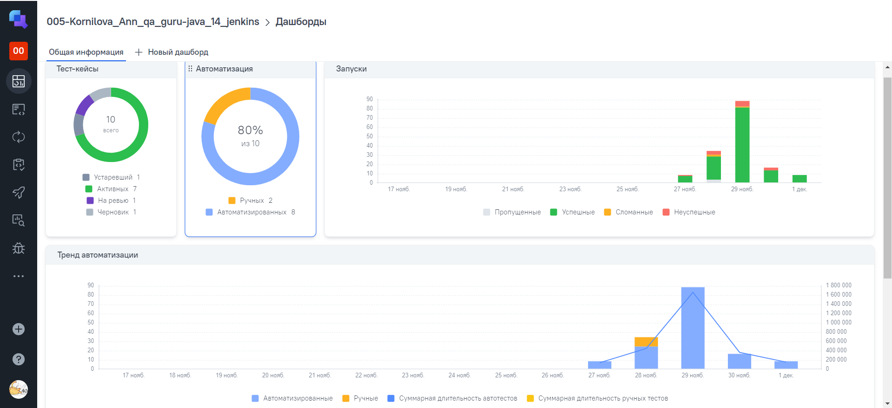

# <p align="center">Проект по автоматизации тестовых сценариев для сайта компании [АО «НСПК»](https://nspk.ru/)</p>   
  
> Акционерное общество «Национальная система платежных карт» (НСПК) — оператор платежной системы «Мир», операционный платежный и клиринговый центр Системы быстрых платежей (СБП)

 ____
 
## Содержание
____

* <a href="#tools">Технологии и инструменты</a>

* <a href="#project_goal">Цель проекта</a>

* <a href="#cases">Примеры автоматизированных тест-кейсов</a>

* <a href="#jenkins">Сборка в Jenkins</a>


* <a href="#console">Запуск из терминала</a>

* <a href="#allure">Allure отчет</a>

* <a href="#allure-testops">Интеграция с Allure TestOps</a>

* <a href="#jira">Интеграция с Jira</a>

* <a href="#telegram">Уведомление в Telegram при помощи бота</a>

* <a href="#video">Примеры видео выполнения тестов на Selenoid</a>

___
 
<a id="tools"></a>
## <a name="Технологии и инструменты"> Технологии и инструменты: </a>

<p align="left">
<a href="https://www.jetbrains.com/idea/">
<a href="https://www.java.com/ru/">
<a href="https://github.com/">
<a href="https://junit.org/junit5/">
<a href="https://gradle.org/">
<a href="https://www.jenkins.io/">
<a href="https://www.atlassian.com/software/jira">
<a href="https://github.com/allure-framework">
<a href="https://selenide.org/">
<a href="https://aerokube.com/selenoid/">
<a href="https://qameta.io/">
<a href="https://telegram.org/">
</p>

____

<a id="project_goal"></a>
## <a name="Цель проекта"> Цель проекта </a>

> <p>Проект является демонстрационным и включает в себя ряд автоматизированных тестов пользовательского интерфейса (UI), охватывающих различные аспекты функциональности, обеспечивая качество, надежность и стабильность работы веб-приложения.</p>

 ____

<a id="cases"></a>
## <a name="Примеры автоматизированных тест-кейсов"> Примеры автоматизированных тест-кейсов </a>

- Проверка pdf-файлов на страницах Правила и тарифы платежной системы «Мир», Брендбук НСПК;
- Проверка перехода со страницы Систему быстрых платежей, открытие страницы Углеметбанка;
- Проверка содержания страницы Универсальный QR;
- Проверка содержания страниц "Банкам" - "Руководства", "Эквайринг SoftPOS", "Правила и тарифы платежной системы «Мир»", "Сервис «Аналитика»", "Сервис привязки фискальных чеков к банковским транзакциям";
- Проверка контента страницы Контакты;
- Проверка содержания страницы Компания АО «НСПК»;
- Проверка ссылок, телефонов, логотипа в "подвале" сайта на главной странице.

____

<a id="jenkins"></a>
## <a name="Сборка в Jenkins"> Сборка в [Jenkins](https://jenkins.autotests.cloud/job/005-Kornilova_Ann_qa_guru-java_14_jenkins/) </a>

<p align="center">  
<a href="https://jenkins.autotests.cloud/job/005-Kornilova_Ann_qa_guru-java_14_jenkins/"></a>  
</p>

<a id="jenkins_parameters"></a>
### <a name="Параметры сборки в Jenkins"> Параметры сборки в Jenkins </a>

- REPOSITORY (репозиторий для запуска job'а)
- BROWSER (браузер для запуска тестов)
- BROWSER_VERSION (версия браузера, по умолчанию)
- SCREEN_RESOLUTION (размер окна браузера)
- URL (адрес для запуска тестов)
- COMMENT (комментарий для сборки)
- ENVIRONMENT (окружение развёртывания ПО)

<p align="center">  
<a href="https://jenkins.autotests.cloud/job/005-Kornilova_Ann_qa_guru-java_14_jenkins/build?delay=0sec"></a>  
</p>

_____

<a id="console"></a>
## Команды для запуска из терминала

**Локальный запуск с параметрами по умолчанию**
```bash  
gradle clean smoke_test 
```

**Локальный запуск с указанием параметров**
```bash  
gradle clean smoke_test
-Dbrowser=chrome
-DbrowserVersion=100
-DbrowserSize=1920x1080
-Durl=selenoid.autotests.cloud
```

**Удалённый запуск через Jenkins:**
```bash
clean smoke_test 
-Dbrowser=${BROWSER}
-DbrowserVersion=${BROWSER_VERSION}
-DbrowserSize=${SCREEN_RESOLUTION}
-Durl=${URL}
```

_____

<a id="allure"></a>
## <a name="Allure">Allure [отчет](https://jenkins.autotests.cloud/job/005-Kornilova_Ann_qa_guru-java_14_jenkins/27/allure/)</a>

### Основная страница отчёта

<p align="center">  
  
</p>  

### Тест-кейсы

<p align="center">  
  
</p>

<p align="center">  
  
</p>

<p align="center">  
  
</p>

### Графики

  <p align="center">  


  
</p>

___

<a id="allure-testops"></a>
## <a name="Allure_TestOps">Интеграция с [Allure TestOps](https://allure.autotests.cloud/launch/43014)</a>

### *Allure TestOps Dashboard*

<p align="center">  
  
</p>  

### *Авто тест-кейсы*

<p align="center">  
  
</p>

___
<a id="jira"></a>
## <a name="Jira">Интеграция с [Jira](https://jira.autotests.cloud/browse/HOMEWORK-1369)</a>

<p align="center">  
  
</p>

<p align="center">  
  
</p>

____

<a id="telegram"></a>
##  <a name="Telegram"> Уведомление в Telegram </a>

<p align="center">  
  
</p>

____

<a id="mail"></a>
##  <a name="Mail"> Уведомление на почту </a>

<p align="center">  
  
</p>

____

<a id="video"></a>
##  <a name="Telegram"> Примеры выполнения тестов </a>

<p align="center">
   
</p>

<details>
<summary>Ещё примеры выполнения тестов</summary>
<p align="center">
   
</p>

<p align="center">
   
</p>

<p align="center">
   
</p>

<p align="center">
   
</p>

<p align="center">
   
</p>

<p align="center">
   
</p>

<p align="center">
   
</p>
</details>
